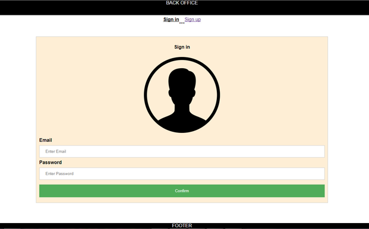

FOR OPENING THIS APLICATION

1. clone code in local folder
2. open chosen local folder where is cloned code in command prompt
3. type "npm install" (instaling node models)
4. type "npm start"
5. when is opened in internet browser, please test our aplication

