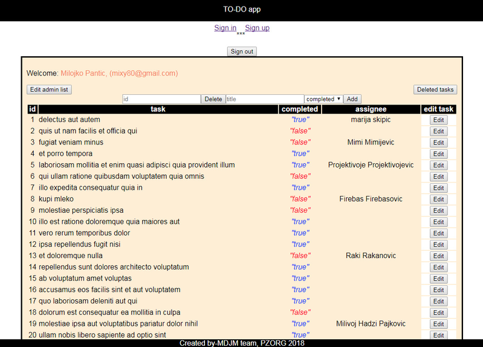
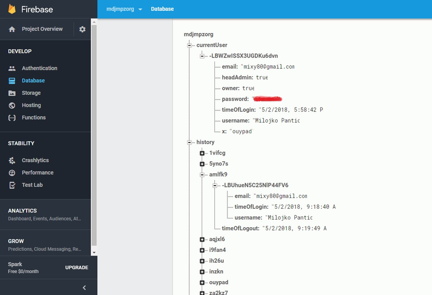
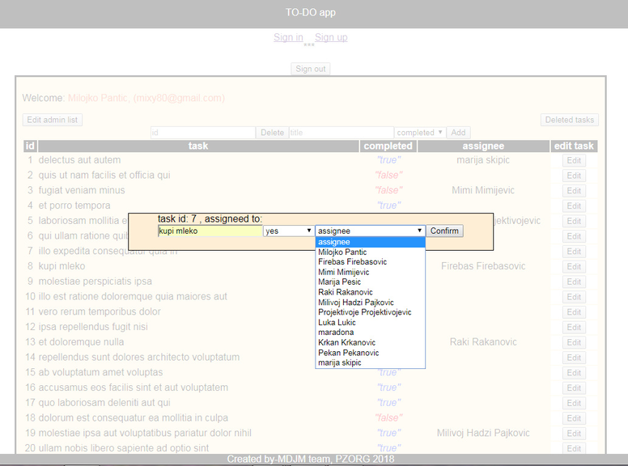

### FOR OPENING THIS APLICATION:
  
1. clone it in the project directory
#### `git-clone` - Clone a repository into a new directory
 
2. open the project directory with command prompt
 
3. run `npm install` 
#### `npm install` - Installing node modules
 
 
 
 4. run `npm start`
 #### `npm start`
 
 Runs the app in the development mode. 
 Open [http://localhost:3000](http://localhost:3000) to view it in the browser.
 
 The page will reload if you make edits. 
 You will also see any lint errors in the console.
  

#### You can test this aplication at: http://mixyznik-todoproj.surge.sh/
  
#### Or at: https://to-do-pro.herokuapp.com/  
 
 
 
 ### `sign in page`
 
 
 ### `sign up page`
 

 ### `to do list page`
 
 
 ### `firebase database`
 
 
 ### `admin list page`
 
 
 ### `details page`
 
 
 ### `edit task page`
 